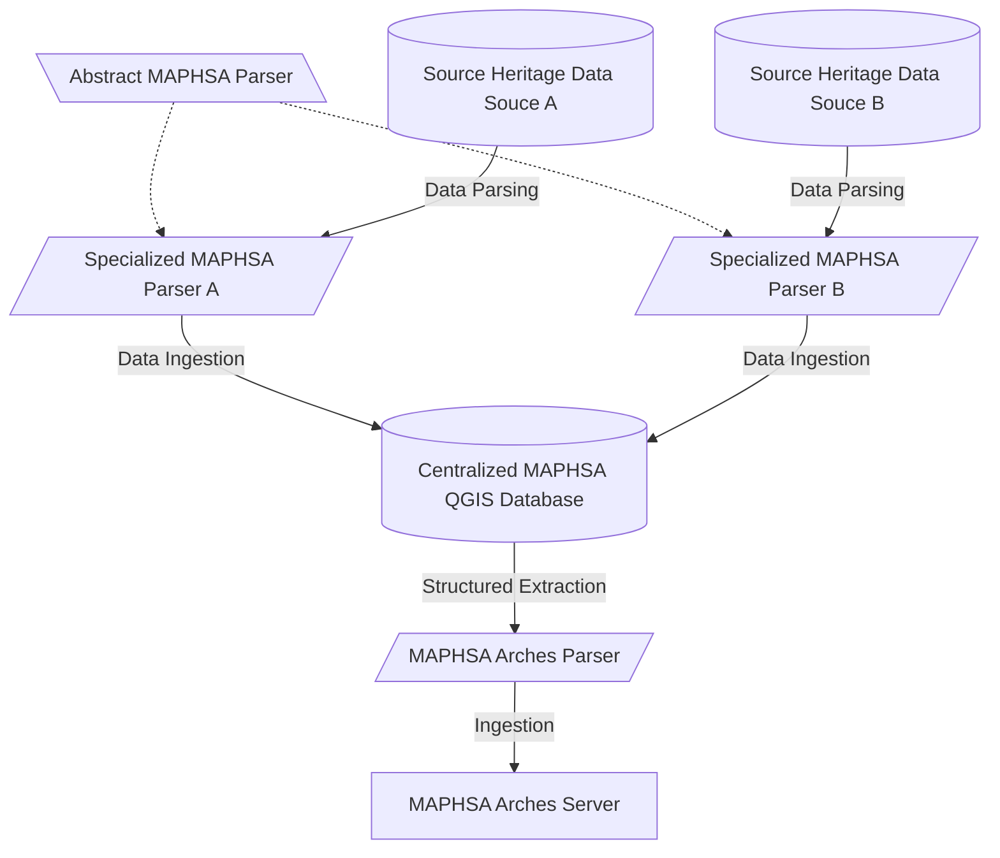

# MAPHSA Parser

Parser meant to read semi-structured dataframes and ingest the resulting heritage site data into a **QGIS/PostGIS database**. 

## General Architecture
The projected architecture forsees the pipeline to funnel data to both of the databases.
* The **Centralized MAPHSA QGIS Database** will hold the integrated depository of heritage data for the project meant to be edited and rendered.
* Every **Source Heritage Data Source** contains heritage site semi-structured data relevant to MAPHSA.
* The **Abstract MAPHSA Parser** is used to specialized **Specialized MAPHSA Parsers** capable of parsing the relevant **Source Heritage Data Source** and ingesting the result into the **Centralized MAPHSA QGIS Database**.
* The **MAPHSA Arches Parser** can extract data from the **Centralized MAPHSA QGIS Database** and ingest it into the **MAPHSA Arches Server**.

## Supported Source Heritage Data Sources
* Brazilian SICG data.

## Major Update History
* 11/17/2023 - Initial commit. SICG data support is built-in.
